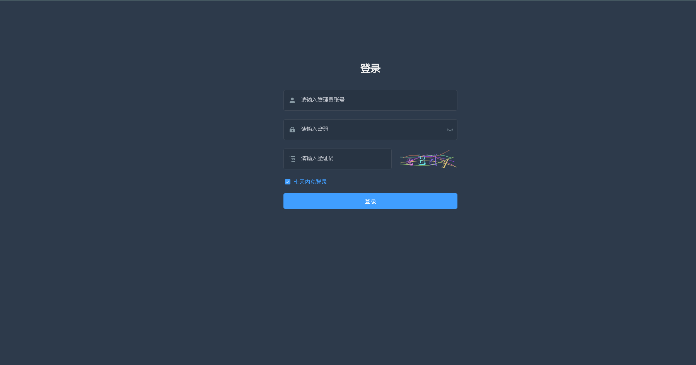
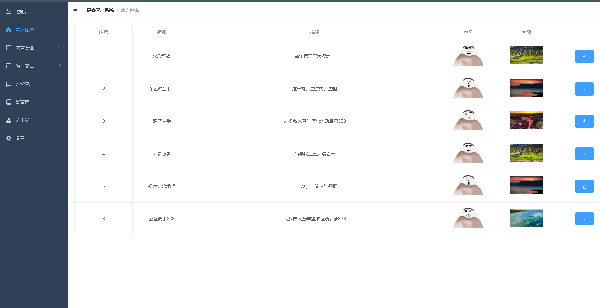
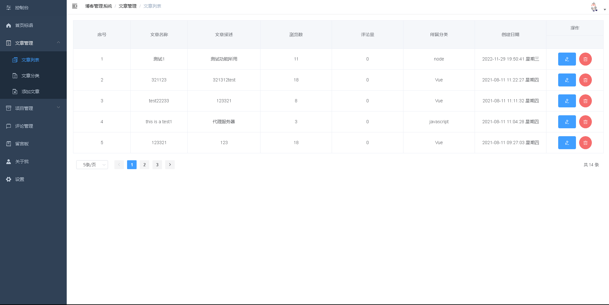
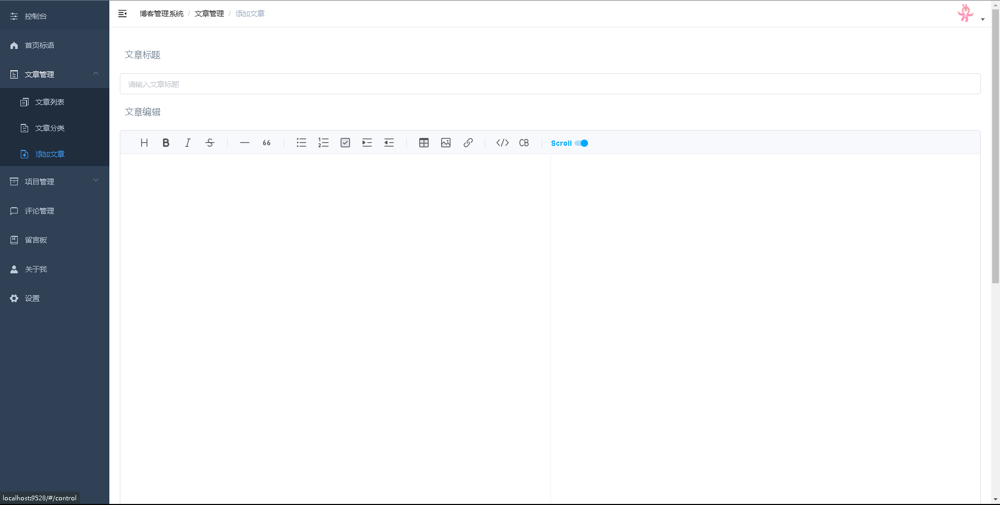
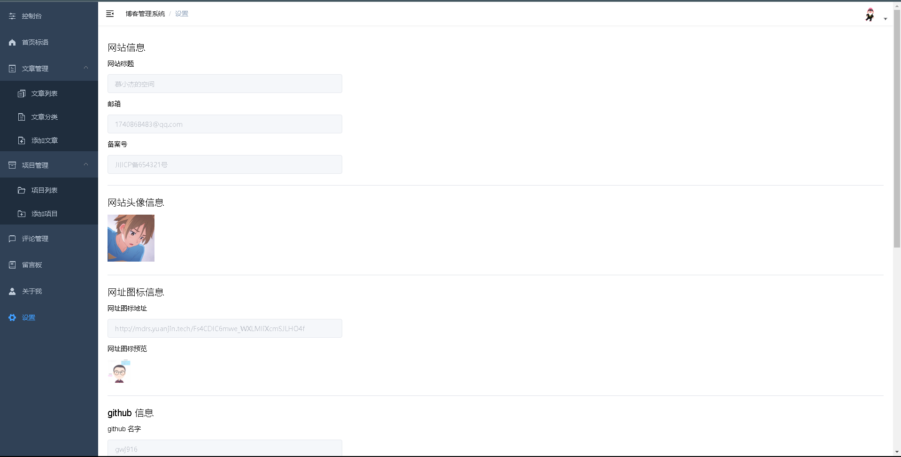

## 个人博客管理系统

个人博客管理系统是用于管理和运营个人博客的软件平台，旨在提供方便、高效的博客内容管理和运营功能。该系统通常包括以下主要特点和功能：

1．用户友好性：系统应该易于使用，用户可以轻松地创建、编辑和发布博客文章，同时也可以方便地管理自己的博客。

2．安全可靠：个人博客系统需要具备完善的安全措施，保障用户信息和数据的安全性。

3．易用性和可维护性：个人博客系统需要具备良好的易用性和可维护性，方便用户进行管理和维护。同时，系统本身也需要易于维护和更新，便于开发者对系统进行升级和修复。

4．社交化：个人博客系统应该具备社交化的特点，方便用户与其他读者进行交流和互动。

5.高效性和稳定性：个人博客系统需要具备高效性和稳定性，保证系统能够快速响应并保持稳定状态。

## 使用技术 Vue2.0 + Vue-admin + Element Ui + Axios + Vue-Router + VueX + Egg + MongoDB

#### server 文件是Egg.js编写的服务端
#### test 文件是博客后台
#### blogsystem 文件是博客前台
#### mysiteDB 文件是mongodb数据库备份文件

#### 依赖安装
```
npm install
```

#### 项目启动
```
npm run serve
```

### 项目展示






